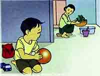
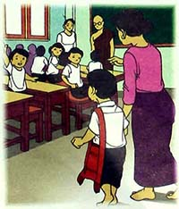
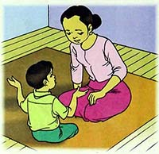

# သင်ခန်းစာ (၁)

ဓမ္မစကူးလ် သွားကြမယ်

## ဓမ္မစကူးလ် သွားကြမယ်

- လာပါ သူငယ်ချင်း ဓမ္မစကူးလ် သွားကြမယ် ။
- ဘုန်းဘုန်းတွေ့မယ် ... ဆရာလေးတွေ့မယ်.... ကုသိုလ်တွေရမယ်....။
- လာပါ သူငယ်ချင်း ဓမ္မစကူးလ် သွားကြမယ်။
- ယဉ်ကျေးရမယ် ....သိမ်မွေ့ရမယ်.... ပျော်ရွှင်သွားရမယ်...။
- လာပါ သူငယ်ချင်း ဓမ္မစကူးလ် သွားကြမယ်။
- ဆေးရောင်ခြယ်မယ် .... ပုံပြောပြမယ်... သီချင်းတွေ ဆိုကြမယ်....။
- လာပါ သူငယ်ချင်း ဓမ္မစကူးလ် သွားကြမယ်။
- ယဉ်ကျေးရမယ် ... သိမ်မွေ့ရမယ် ... ပျော်ရွှင်သွားရမယ်....။

## ပျော်စရာ ဓမ္မစကူးလ်

ကစားမက်သော မောင်မောင်သည် မိဘကို မကူညီပါ။

ဘုရားမရှိခိုးဘဲ အိပ်သည်။

သူငယ်ချင်းများ ဓမ္မစကူးလ် သွားကြ၍  မောင်မောင့်မှာ ကစားဖော် မရှိပါ။

မေမေက ဓမ္မစကူးလ် သွားရန် မောင်မောင့်ကို ပြောသည်။

ဓမ္မစကူးလ်သို့ ရောက်သောအခါ မောင်မောင့်ကို သူငယ်ချင်းများက လှမ်းခေါ်ကြသည်။

ဓမ္မစကူးလ်၏ ပျော်စရာကောင်းပုံများကို အိမ်ရောက်သောအခါ မေမေ့အားပြောပြသည်။

## ဓမ္မစကူးလ် သွားကြစို့

- ဓမ္မစကူးလ် ဓမ္မစကူးလ်၊
- တရားတွေ သင်တဲ့ ဓမ္မစကူးလ်။
- ဓမ္မစကူးလ် သွားမှသာ၊
- တရားတွေ သင်ရမှာ။
- တရားတွေ သင်ယူဖို့။
- ဓမ္မစကူးလ် သွားကြစို့။      ။

